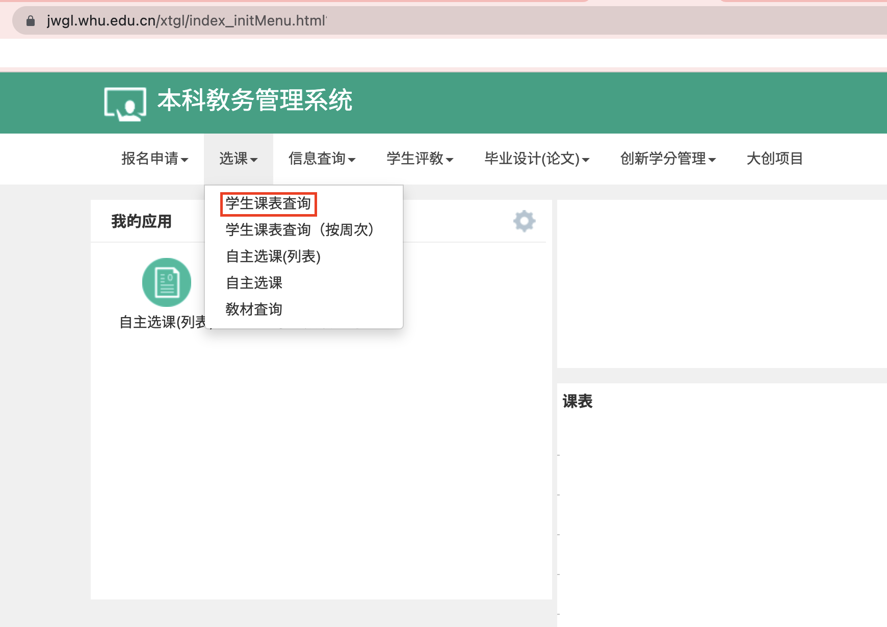
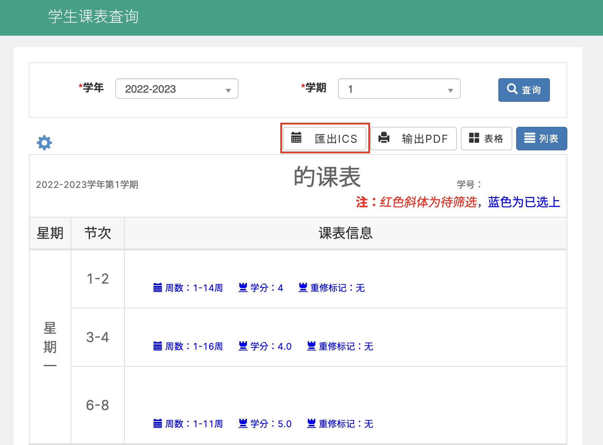
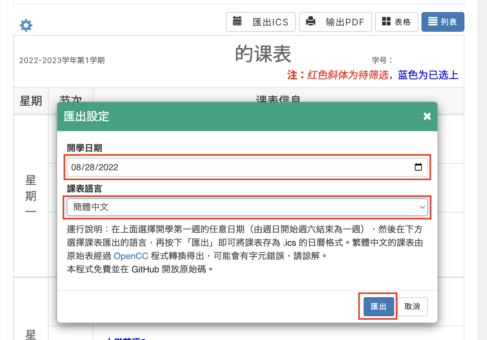

# 武大课程表导出为 iCS

语言: [English](README.md) | 简体中文 | [繁体中文](README-TC.md)

## 介绍

[武大课程表导出为 iCS](#) 是一个可以将您的课表导出为 iCalendar 日历格式的 Tempetmonkey / Greasemonkey 组件。

## 特性

- 简繁中文转换支持
- 多时区支持（课表的时间会根据浏览器时区动态调整）
- 所有信息都为本机处理，没有数据会上传至任何服务器

## 使用教学

1. 打开您的教务系统，按下「```学生课表查找```」。 



2. 如果您已经安装本组件，将会有一个「```导出iCS```」按键出现在「```导出PDF```」左侧.。按下界面左侧的「```⚙```」选择显示在课表中的内容（也是最终导出到日历中的内容） **注意「```时间```」 选项必须选中，否则日历将不会生成！** 然后按下「```导出iCS```」开启导出菜单。



3. 选择开学的日期及语言然后按下「```导出```」。



您将会得到一个 iCS 格式的日历事件文件，可以将它导入到您的日历软件中。

## 使用的 Libs

- [jQuery](https://jquery.com/)
- [Bootboxjs](http://bootboxjs.com/)
- [OpenCC-js](https://github.com/nk2028/opencc-js)
  
## 特别感谢

- [Eric_Lian](https://github.com/ExerciseBook)