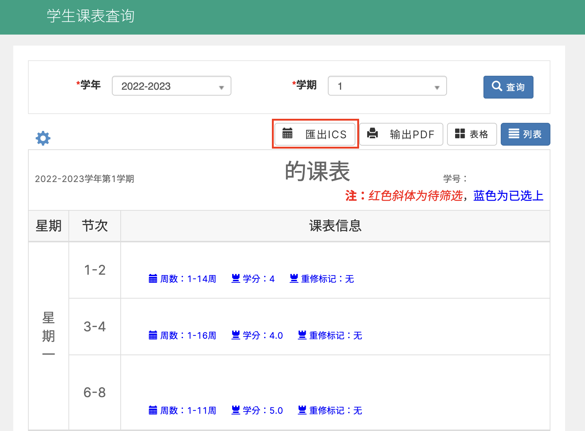

# 武大課程表匯出為 iCS

語言: [English](README.md) | [簡體中文](README-SC.md) | 繁體中文

## 更新日誌
### v0.90 - Sep 5, 2022
- 新增特性：加入可選的課前提醒功能，並可以單獨設定早上、下午、晚上的第一節課

### v0.89.2 - Sep 5, 2022
- 修復 bugs：修復無確定上課時間的課造成的匯出問題

### v0.89.1 - Sep 2, 2022
- 修復 bugs: 修復時區偏移問題

## 介紹

[武大課程表匯出為 iCS](#) 是一個可以將您的課表匯出為 iCalendar 日曆格式的 Tempetmonkey / Greasemonkey 組件。

## 特性

- 簡繁中文轉換支援
- 多時區支援（課表的時間會根據瀏覽器時區動態調整）
- 所有資訊都為本機處理，沒有資料會上傳至任何伺服器

## 使用教學

1. 打開您的教務系統，按下「```学生课表查找```」。 


2. 如果您已經安裝本組件，將會有一個「```导出iCS```」按鍵出現在「```导出PDF```」左側.。按下介面左側的「```⚙```」選擇顯示在課表中的內容（也是最終匯出到日曆中的內容） **注意「```时间```」 選項必須選中，否則日曆將不會生成！** 然後按下「```导出iCS```」開啟匯出選單。



3. 選擇開學的日期及語言然後按下「```导出```」。


您將會得到一個 iCS 格式的日曆事件檔案，可以將它匯入到您的日曆軟體中。

## 使用的 Libs

- [jQuery](https://jquery.com/)
- [Bootboxjs](http://bootboxjs.com/)
- [OpenCC-js](https://github.com/nk2028/opencc-js)
- [ics.js](https://github.com/nwcell/ics.js)
  
## 特別感謝

- [Eric_Lian](https://github.com/ExerciseBook)