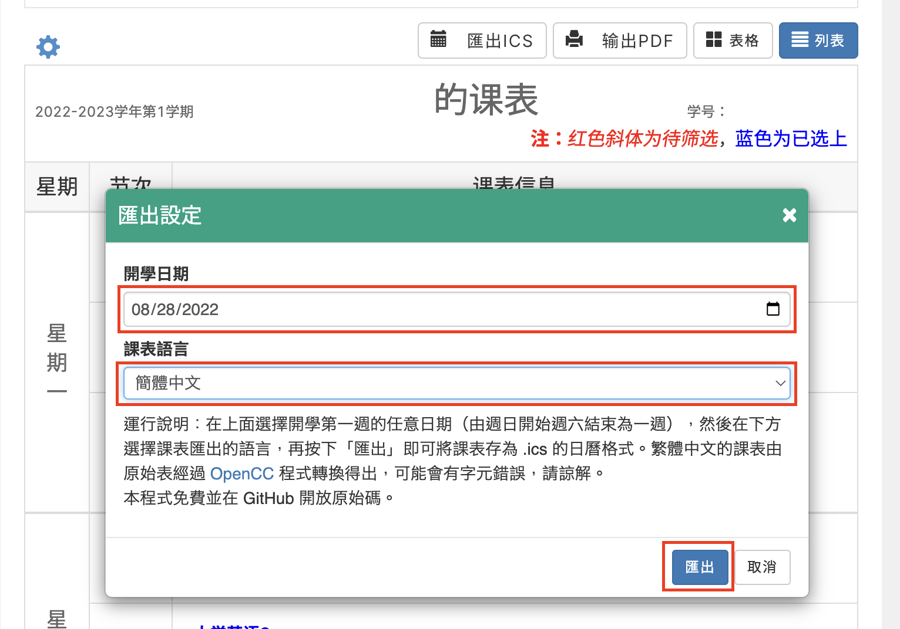

# WHU Class Schedule Export as iCS

Languages: English | [簡體中文](README-SC.md) | [繁體中文](README-TC.md)

## Introduction

[WHU Class Schedule Export  as iCS](#) is a Tempermonky / Greasemonkey plugin which can help you export your class schedule to the calendar on your phone / pad / PC / Mac.

## Features

- Chinese conversion support
- Multi-timezone support (always return the right time no matter which zone you device in)
- No data upload, all the data is processed on your device

## How to Use

1. Open your Teaching Administration System, and click "```Show my schedule (学生课表查找)```" button.


2. If you have installed the plugin, there will be a new button called "```Export as iCS (导出iCS)```". Choose what data you want to show on your calendar by clicking the "```⚙```" icon on the left and selecting the items displayed on the screen. **The schedult WON'T export if you unselect the "```Time (时间)```" item!** After that, click the "```Export as iCS (导出iCS)```" button to open the export panel.


3. Select the first day of your term and your preferred language, and click the "```Export (导出)```" button.



Now your schedule is saved as an iCS calendar. You can import the file to your calendar app.

## Libaries Used

- [jQuery](https://jquery.com/)
- [Bootboxjs](http://bootboxjs.com/)
- [OpenCC-js](https://github.com/nk2028/opencc-js)
- [ics.js](https://github.com/nwcell/ics.js)
  
## Special Thanks

- [Eric Lian](https://github.com/ExerciseBook)